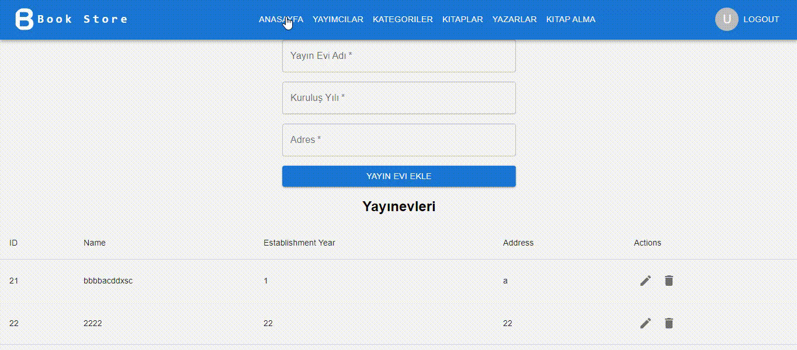

<h1 align="center">Kitap Yönetim Sistemi - Frontend</h1>
<h4 align="justify"> 
Bu proje, bir Kitap Yönetim Sistemi'nin front-end kısmını oluşturan bir React uygulamasıdır. Kullanıcılar kitapları görüntüleyebilir, güncelleyebilir, yeni kitap ekleyebilir ve kitapları silebilirler. Kitaplar yazar ve yayınevi bilgileriyle birlikte kaydedilir.
</h4>
<p>
<a href="https://kitap-yonetim-sistemi-frontend.vercel.app/">Site Linki</a> <br>
</p>

<h2 id="table-of-contents"> :book: İçerik</h2>

<details open="open">
  <summary>İçerik</summary>
  <ol>
    <li><a href="#proje-ozeti"> ➤ Proje Özeti</a></li>
    <li><a href="#teknolojiler"> ➤ Kullanılan Teknolojiler</a></li>
    <li><a href="#kurulum"> ➤ Kurulum ve Başlatma</a></li>
    <li><a href="#sistem-gorselleri"> ➤ Uygulama Görselleri</a></li>
    <li><a href="#önemli"> ➤ Önemli Dosyalar</a></li>
  </ol>
</details>


<!-- PROJECT OVERVIEW -->
<h2 id="proje-ozeti"> :mag_right: Proje Özeti</h2>

<p align="justify"> 
Kitap Yönetim Sistemi, kitapların yönetilmesine olanak sağlayan bir web uygulamasıdır. Bu uygulama, kullanıcıların kitapları görüntülemesine, yeni kitaplar eklemesine, mevcut kitapları güncellemesine ve kitapları silebilmesine imkan tanır. Kitaplar yazar ve yayınevi bilgileriyle birlikte kaydedilir, ve bu bilgileri dropdown menülerden seçerek kullanıcı dostu bir arayüzde yönetebilirsiniz.

Projenin front-end kısmı React.js ile geliştirilmiş olup, Material UI bileşenleri kullanılarak modern bir kullanıcı arayüzü oluşturulmuştur. CRUD (Create, Read, Update, Delete) işlemleri gerçekleştirilebilmekte ve API ile entegrasyon sağlanarak veriler güncellenmektedir.

Temel olarak bu proje, bir kütüphane veya kitap envanteri yönetiminde kullanılabilecek bir sistem sağlar.
</p>


<!-- USED TECHNOLOGIES -->
<h2 id="teknolojiler">:computer: Kullanılan Teknolojiler</h2>

<p align="justify"> 
Projede kullanılan teknolojiler:

[](https://vitejs.dev/) <br>
[](https://reactjs.org/) <br>
[](https://mui.com/) <br>
[](https://reactrouter.com/) <br>
[](https://axios-http.com/) <br>
[](https://kenwheeler.github.io/slick/) <br>
[](https://reactcommunity.org/react-modal/) <br>
[](https://www.w3.org/Style/CSS/) <br>
[](https://code.visualstudio.com/)
</p>


<h2 id="önemli">Önemli Dosyalar</h2>
<p align="justify"> 
src/components/Book/BookList.js - Kitap listesini gösteren bileşen.<br>
src/components/Book/BookForm.js - Yeni kitap eklemek için form bileşeni.<br>
src/components/Book/UpdateModal.js - Kitap güncelleme işlemi için modal bileşeni.<br>
src/pages/BookPage.js - Kitap işlemleri sayfası.<br>
</p>
<!-- SETUP AND LAUNCH -->

<h2 id="kurulum"> :hammer: Kurulum ve Başlatma</h2>

<p align="justify"> 
Projenin düzgün bir şekilde çalışabilmesi için öncelikle Vite kurulumunun yapılması gerekmektedir. Aşağıdaki komutları kullanarak kurulumları gerçekleştirebilirsiniz.
Node.js ve npm'in kurulu olduğundan emin olun.
Uygulama tarayıcıda http://localhost:5173 adresinde çalışacaktır.

```bash
# Vite projesi oluşturma
npm create vite@latest 

# Proje dizinine geçiş
cd kitap-yonetim-sistemi

# Gerekli bağımlılıkları yükleme
npm install

# Projeyi çalıştırma
npm run dev

```


<!-- PROGRAM SCREENSHOTS -->
<h2 id="sistem-gorselleri"> :camera: Site İçi Görseller</h2>

<p align="justify"> 


 
</p>

<h4> I would like to thank Kerem Yardan for his support. </h4>